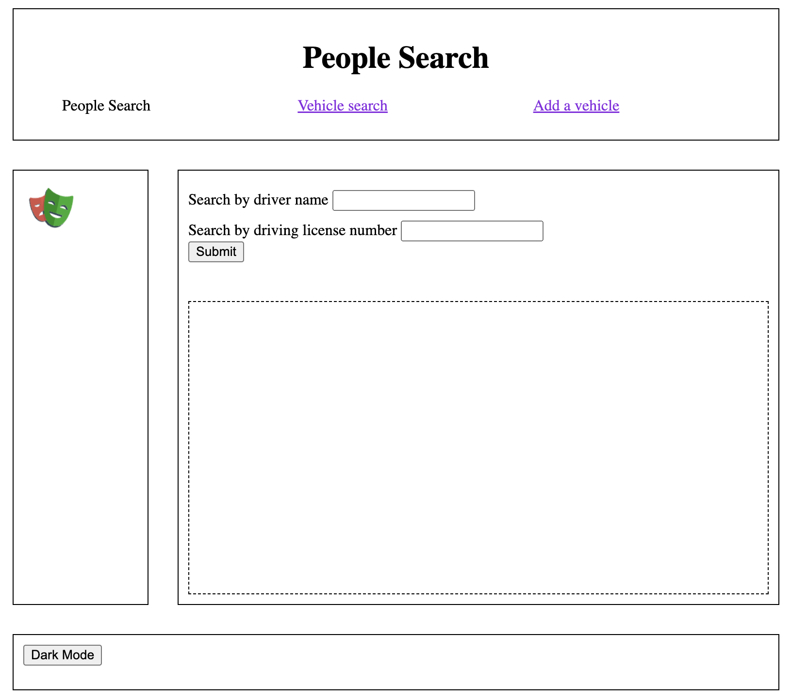
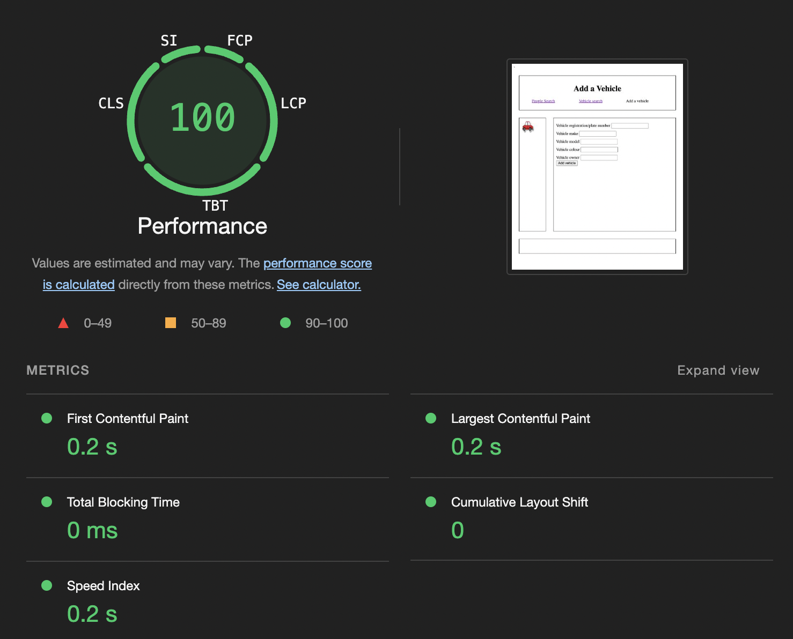
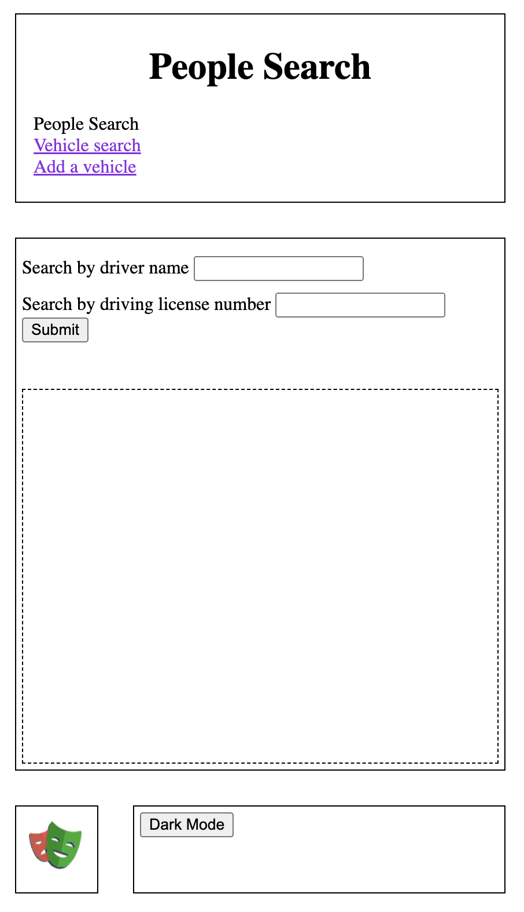
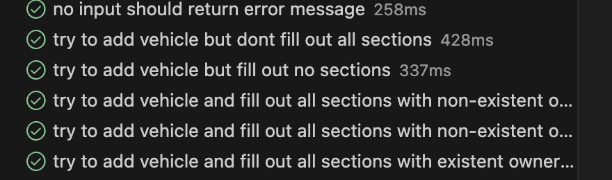
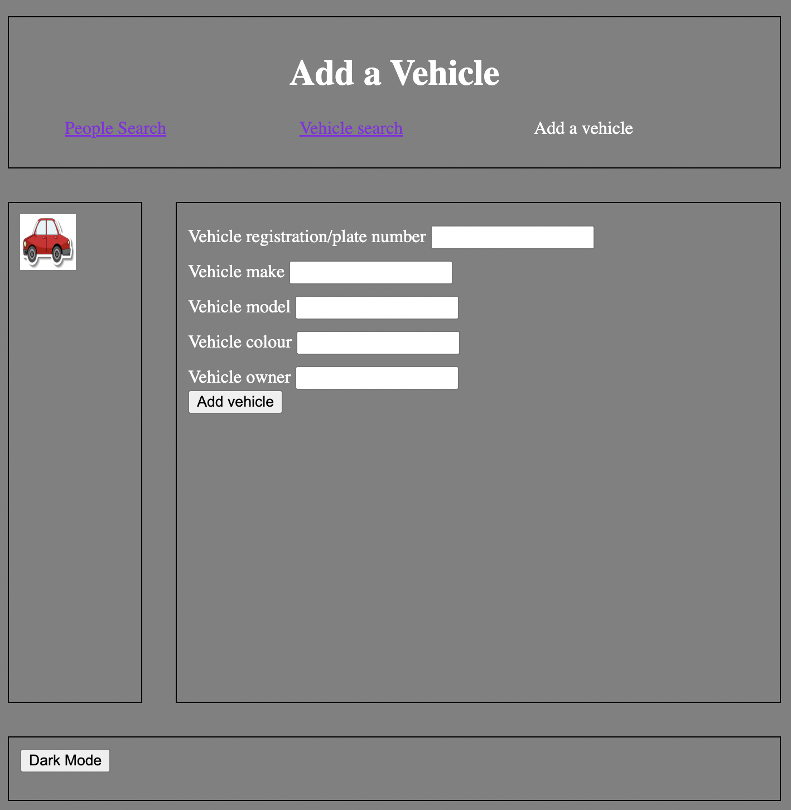

# Interfaces Coursework

- Name: Kardelen Yagiz
- Username: psyky4

|Contents|
|--------|
|[HTML extra work](#html-extra-work)|
|[CSS extra work](#css-extra-work)|
|[JavaScript extra work](#javascript-extra-work)|
|[JavaScript top test](#top-test)|
|[Extra work: dark mode](#extra-work)|


This is my markdown description of my interfaces coursework.

My three html files are:
- [People Search](people-search.html)
- [Vehicle Search](vehicle-search.html)
- [Add Vehicle](add-vehicle.html)

----

These three files outline the layout of my website. They all look very similar:



## HTML extra work
My website has passed the LightHouse test with a score of 100% on both performance and accessibility and a 96% on best practices.



## CSS extra work
Beyond 500mp, my website has a different structure:


line 107 onwards:
```css
@media (max-width: 500px) {
    #container {
        grid-template-areas:
            "header header"
            "main main"
            "sidebar footer";
        grid-template-columns: 1fr 4fr; 
        grid-template-rows: auto 5fr 1fr;
        height: 100%;
    }

    .options {
        flex-direction: column; 
        align-items: flex-start; 
        padding-left: 10px;
    }

    header, aside, main, footer {
        padding: 5px; 
    }

    aside {
        grid-area: sidebar; 
    }

    footer {
        grid-area: footer; 
    }

}
```
## JavaScript Extra Work
I wrote some playwright tests for the third critera of the javascript and database. These can be found in [this file](tests.spec.js). 

**Here are a few examples of the tests, there are more in the test file at the end:**


This tests if the vehicle page will return the correct output if the vehicle number : NG51PKO is passed to it.
```js
//vehicle page
test('search "NG51PKO" should return Ford and owner = 1', async ({page}) => {
    await page.locator('#rego').fill('NG51PKO')
    await page.getByRole('button', { name: 'Submit' }).click();
    await expect(page.locator('#results')).toContainText('Ford')
    await expect(page.locator('#results')).toContainText('1')
    await expect(page.locator('#results').locator('div')).toHaveCount(1)
    await expect(page.locator('#message')).toContainText('Search successful')
 })
```

This tests if the add vehicle page will return a error message if not all the sections are filled out.
```js
//add a vehicle page
test('try to add vehicle but dont fill out all sections', async ({page}) => {
    await page.getByRole('link', { name: 'Add a vehicle' }).click();
    await page.locator('#rego').fill('1')
    await page.locator('#make').fill('2')
    await page.locator('#model').fill('3')
    await page.getByRole('button', { name: 'Add vehicle' }).click();
    await expect(page.locator('#results').locator('div')).toHaveCount(0)
    await expect(page.locator('#message')).toContainText('Error')
})
```

This tests if the add vehicle page will return a error message if none of the sections are filled out.
```js
test('try to add vehicle but fill out no sections', async ({page}) => {
    await page.getByRole('link', { name: 'Add a vehicle' }).click();
    await page.getByRole('button', { name: 'Add vehicle' }).click();
    await expect(page.locator('#results').locator('div')).toHaveCount(0)
    await expect(page.locator('#message')).toContainText('Error')
})
```

##### top test
This tests if the add vehicle page will display the add owner form if an owner that doesnt exist is passed into it, then it will check if the vehicle is added successfully and then checks if the person is added to the People database by going onto the search people page.
```js
test('try to add vehicle and fill out all sections with non-existent owner, then add person and vehicle', async ({page}) => {
   await page.getByRole('link', { name: 'Add a vehicle' }).click();
   await page.locator('#rego').fill('reg')
   await page.locator('#make').fill('make')
   await page.locator('#model').fill('model')
   await page.locator('#colour').fill('colour')
   await page.locator('#owner').fill('Jack')
   await page.getByRole('button', { name: 'Add vehicle' }).click();
   await expect(page.locator('#message')).toContainText('Owner doesnt exist')
   await page.locator('#personid').fill('10')
   await page.locator('#name').fill('Jack')
   await page.locator('#address').fill('NG7 8ET')
   await page.locator('#dob').fill('01/02/2003')
   await page.locator('#license').fill('No6789')
   await page.locator('#expire').fill('01/02/2024')
   await page.getByRole('button', { name: 'Add owner' }).click();
   await expect(page.locator('#message')).toContainText('Vehicle added successfully')
   await page.getByRole('link', { name: 'People Search' }).click();
   await page.locator('#name').fill('jack')
   await page.getByRole('button', { name: 'Submit' }).click();
   await expect(page.locator('#results')).toContainText('No6789')
   await expect(page.locator('#results')).toContainText('01/02/2003')
   await expect(page.locator('#results').locator('div')).toHaveCount(1)
   await expect(page.locator('#message')).toContainText('Search successful')
})
```



## Extra Work
All three pages have a dark mode button available in the footer, this changes the appearance to dark mode. This has been done using javascript.



```js
document.getElementById('darkmode').addEventListener('click',function(event)
{
    let body = document.body;
    let currentBackgroundColor = window.getComputedStyle(body).backgroundColor;
    
    if (currentBackgroundColor === 'rgb(255, 255, 255)') {
        body.style.backgroundColor = 'gray';
        body.style.color = 'white';

    } else {
        body.style.backgroundColor = 'white';
        body.style.color = 'black';
    }

});
```

All my images have alt text that allows screen readers to depict what the image contains.
------
